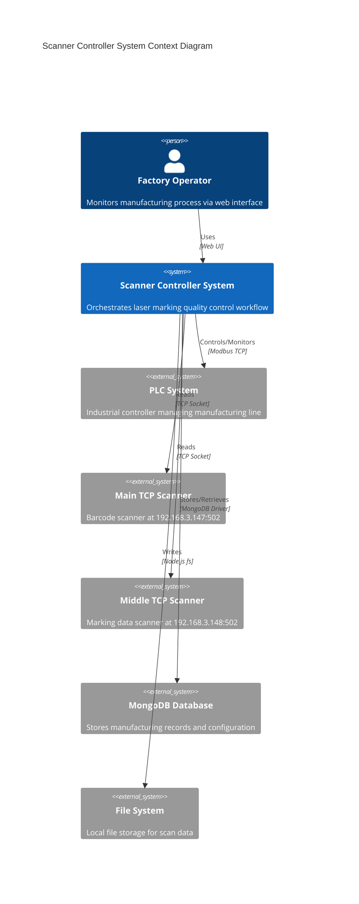
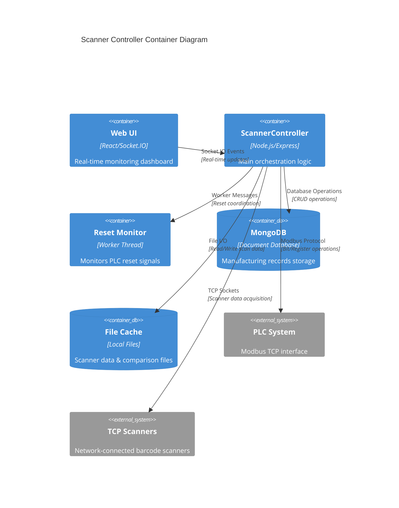
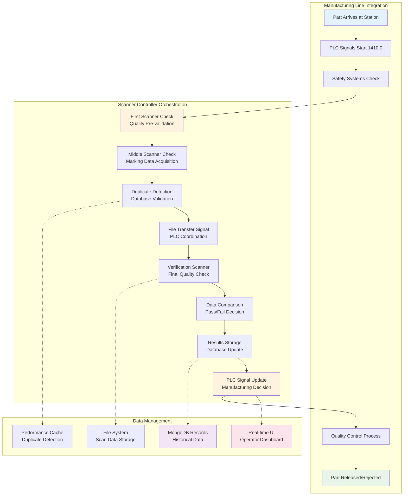
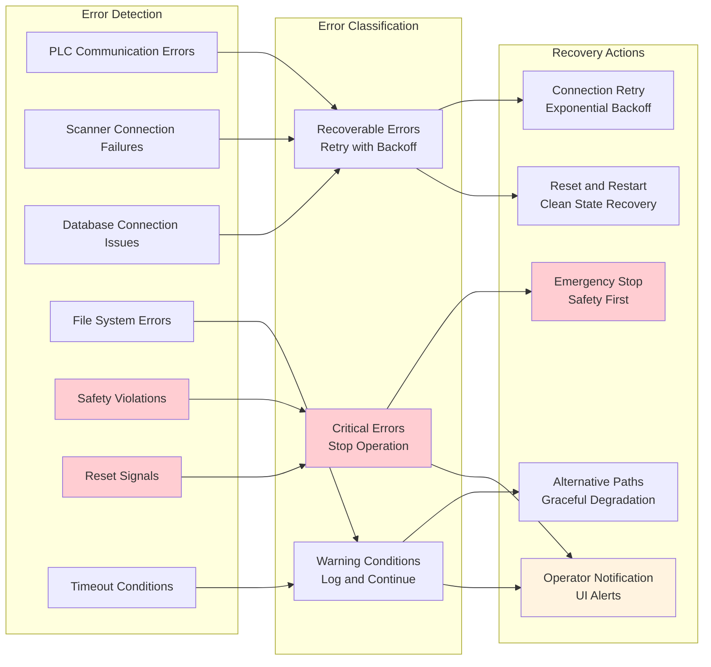
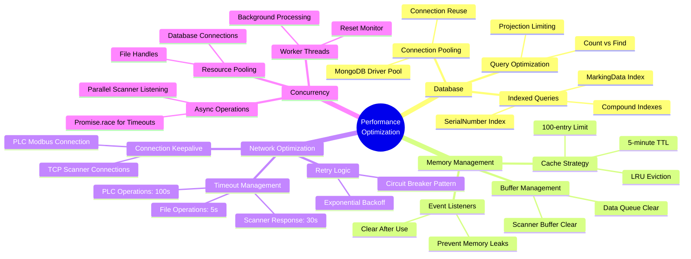
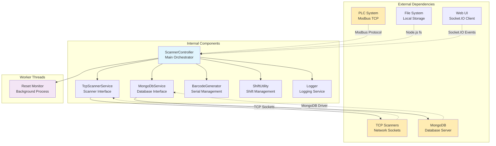

# Business Logic Architecture & Component Integration

## High-Level System Architecture

## Component Architecture Deep Dive

## Business Process Orchestration

## Error Handling & Recovery Architecture

## Performance Optimization Strategy

## Data Flow & Business Rules Matrix

| Process Stage | Input Sources | Business Rules | Output Destinations | Error Handling |
|---------------|---------------|----------------|-------------------|----------------|
| **First Scanner** | Main/Middle TCP Scanners | Always continue workflow regardless of result | PLC bit 1414.7 (NG signal) | Timeout → NG, Continue |
| **Middle Scanner** | Middle TCP Scanner only | Remove @ prefix, Check duplicates | code.txt, text.txt, MongoDB insert | Duplicate → Stop, NG → Continue |
| **Duplicate Check** | MongoDB MarkingData field | 5-min cache, Performance tracking | PLC bit 1414.6, UI notification | DB error → Skip check |
| **File Transfer** | Processed marking data | Write verification files | Local file system | Write error → Try alternative path |
| **Verification** | Main/Middle TCP Scanners | Compare against code.txt | PLC bits 1414.3/4, Registers 3000+ | Timeout → Use NG |
| **PLC Register Write** | Scanner data string | Little-endian encoding, 2 chars per register | PLC registers 3000-N, Status 2999 | Write error → Log, continue |
| **File Persistence** | Scanner data | Multiple save locations with fallback | D:/scan_data.txt, ./scan_data.txt | Path error → Alternative |
| **Database Update** | Complete scan results | Update existing record by SerialNumber+Model | MongoDB records collection | Update fail → Insert new |
| **Final Checks** | PLC bit 1415.7 | 3-second delay, Safety monitoring | Cycle counter, UI broadcast | Safety violation → Stop |

## Integration Points & Dependencies

## Business Critical Success Factors

### 1. **Manufacturing Integration**
- **PLC Timing Synchronization**: Critical handshake protocols with manufacturing line
- **Safety System Integration**: Real-time monitoring of safety interlocks
- **Production Rate Matching**: 2-second cycle delays to match line speed

### 2. **Quality Assurance**
- **Duplicate Prevention**: Cached duplicate detection prevents rework
- **Data Verification**: Triple-check process (marking → verification → comparison)
- **Traceability**: Complete audit trail in MongoDB with timestamps

### 3. **System Reliability**
- **Graceful Degradation**: System continues operation despite component failures
- **Reset Recovery**: Automatic recovery from PLC reset signals
- **Connection Resilience**: Automatic reconnection for all network components

### 4. **Performance Requirements**
- **Real-time Response**: Sub-second response to PLC signals
- **Concurrent Operations**: Parallel scanner listening and safety monitoring
- **Memory Efficiency**: Bounded cache sizes and event listener cleanup

### 5. **Operational Visibility**
- **Real-time Dashboard**: Live cycle counter and status updates
- **Performance Metrics**: Scanner response times and error rates
- **Alert System**: Immediate notification of safety violations and duplicates

This architecture documentation demonstrates how the ScannerController serves as the central orchestrator for a complex manufacturing quality control system, integrating multiple hardware interfaces while maintaining safety, reliability, and performance requirements.