# Complete Execution Flow & Business Logic Orchestration

## Main Execution Flow with Decision Points

```mermaid
flowchart TD
    Start([System Startup]) --> Init[Initialize ScannerController Singleton]
    Init --> ConnMongo[Connect to MongoDB<br/>main-data.records]
    ConnMongo --> ConnTCP1[Connect Main Scanner<br/>192.168.3.147:502]
    ConnTCP1 --> ConnTCP2[Connect Middle Scanner<br/>192.168.3.148:502]
    ConnTCP2 --> InitBarcode[Initialize Barcode Generator]
    InitBarcode --> CreateIndexes[Create Database Indexes]
    CreateIndexes --> StartWorker[Start Reset Monitor Worker]
    StartWorker --> Ready[System Ready]
    
    Ready --> StartScan[runContinuousScan Called]
    StartScan --> WaitStart[Wait for Start Signal<br/>PLC Bit 1410.0 = 1]
    
    WaitStart --> CheckReset1{Check Reset<br/>1600.0 = 1?}
    CheckReset1 -->|Yes| HandleReset[Handle Reset Process]
    CheckReset1 -->|No| CheckSafety1{Safety Check<br/>1490.0-2}
    
    CheckSafety1 -->|Violation| SafetyStop[Stop Cycle - Safety Violation]
    CheckSafety1 -->|OK| FirstScan[Step 1: First Scanner Check]
    
    %% First Scanner Logic
    FirstScan --> TriggerFirst[Trigger PLC 1415.0<br/>Listen Both Scanners]
    TriggerFirst --> FirstTimeout{Timeout or<br/>Data Received?}
    FirstTimeout -->|Timeout/NG| WriteNGBit[Write PLC 1414.7<br/>Signal NG Scan]
    FirstTimeout -->|Data| DebugMode[DEBUG: Continue Anyway<br/>Write PLC 1414.7]
    
    WriteNGBit --> MiddleScan[Step 2: Middle Scanner Check]
    DebugMode --> MiddleScan
    
    %% Middle Scanner Logic
    MiddleScan --> TriggerMiddle[Trigger PLC 1418.0<br/>Listen Middle Scanner]
    TriggerMiddle --> MiddleTimeout{Data Received?}
    MiddleTimeout -->|No/NG| SaveNGRecord[Save NG Record to DB]
    MiddleTimeout -->|Yes| ProcessMiddle[Process Middle Data<br/>Remove @ Symbol]
    
    SaveNGRecord --> SignalTransfer
    ProcessMiddle --> DuplicateCheck[Check Duplicate Cache<br/>5min TTL, 100 entries]
    
    DuplicateCheck --> IsDuplicate{Duplicate Found?}
    IsDuplicate -->|Yes| WriteDupBit[Write PLC 1414.6<br/>Save Duplicate Record]
    IsDuplicate -->|No| WriteFiles[Write code.txt & text.txt<br/>Insert New DB Record]
    
    WriteDupBit --> WaitStart
    WriteFiles --> SignalTransfer[Step 3: Signal File Transfer]
    
    %% Signal Transfer Logic
    SignalTransfer --> WriteTransferBit[Write PLC 1414.15<br/>Signal File Transfer]
    WriteTransferBit --> WaitTransfer[Wait for PLC 1410.3 = 1]
    WaitTransfer --> CheckReset2{Reset During Wait?}
    CheckReset2 -->|Yes| UpdateNGRecord[Update Record as NG]
    CheckReset2 -->|No| VerificationScan[Step 4: Verification Scanner]
    
    UpdateNGRecord --> HandleReset
    
    %% Verification Scanner Logic
    VerificationScan --> TriggerVerify[Trigger PLC 1416.15<br/>Listen Both Scanners]
    TriggerVerify --> VerifyTimeout{Data Received?}
    VerifyTimeout -->|No| UseNGData[Use 'NG' as Scanner Data]
    VerifyTimeout -->|Yes| UseActualData[Use Actual Scanner Data]
    
    UseNGData --> CompareData[Compare with code.txt File]
    UseActualData --> CompareData
    
    CompareData --> IsMatch{Data Matches?}
    IsMatch -->|Yes| WriteMatchBit[Write PLC 1414.3<br/>Data Match OK]
    IsMatch -->|No| WriteNoMatchBit[Write PLC 1414.4<br/>Data No Match]
    
    WriteMatchBit --> WriteRegisters[Write Data to PLC Registers<br/>3000+ with little-endian encoding]
    WriteNoMatchBit --> WriteRegisters
    
    WriteRegisters --> SaveFile[Save to D:/scan_data.txt<br/>With fallback path]
    SaveFile --> UpdateDB[Update DB Record<br/>With Final Results]
    UpdateDB --> FinalChecks[Step 5: Final Checks]
    
    %% Final Checks Logic
    FinalChecks --> WaitFinal[Wait for PLC 1415.7 = 1]
    WaitFinal --> CheckReset3{Reset During Final?}
    CheckReset3 -->|Yes| HandleReset
    CheckReset3 -->|No| CheckSafety2{Safety Violation?}
    CheckSafety2 -->|Yes| SafetyStop
    CheckSafety2 -->|No| FinalDelay[3 Second Delay]
    
    FinalDelay --> IncrementCounter[Increment Cycle Counter<br/>Broadcast to UI<br/>Emit Success Event]
    IncrementCounter --> ResetBits[Reset All PLC Bits<br/>1414.3,4,6,7 | 1415.4 | 1410.0,3]
    ResetBits --> CycleDelay[2 Second Cycle Delay]
    CycleDelay --> WaitStart
    
    %% Reset Handler Logic
    HandleReset --> ResetPLCBits[Reset All PLC Bits]
    ResetPLCBits --> DecrementSerial[Decrement Serial Number]
    DecrementSerial --> ClearBuffers[Clear Scanner Buffers<br/>Remove Event Listeners]
    ClearBuffers --> RestartCycle[Restart Cycle]
    RestartCycle --> WaitStart
    
    %% Safety Stop Logic
    SafetyStop --> EmitSafetyEvent[Emit Safety Violation to UI<br/>Log Safety Details]
    EmitSafetyEvent --> WaitSafetyClear[Wait for Safety Clear]
    WaitSafetyClear --> WaitStart
    
    %% Styling
    classDef startEnd fill:#e1f5fe,stroke:#01579b,stroke-width:2px
    classDef process fill:#f3e5f5,stroke:#4a148c,stroke-width:1px
    classDef decision fill:#fff3e0,stroke:#e65100,stroke-width:2px
    classDef success fill:#c8e6c9,stroke:#1b5e20,stroke-width:2px
    classDef error fill:#ffcdd2,stroke:#c62828,stroke-width:2px
    classDef plc fill:#e8eaf6,stroke:#283593,stroke-width:1px
    
    class Start,Ready startEnd
    class Init,ConnMongo,ConnTCP1,ConnTCP2,InitBarcode,CreateIndexes,StartWorker process
    class CheckReset1,CheckSafety1,FirstTimeout,MiddleTimeout,IsDuplicate,CheckReset2,VerifyTimeout,IsMatch,CheckReset3,CheckSafety2 decision
    class IncrementCounter,WriteFiles success
    class HandleReset,SafetyStop,WriteDupBit error
    class TriggerFirst,WriteNGBit,TriggerMiddle,WriteTransferBit,TriggerVerify,WriteMatchBit,WriteNoMatchBit,WriteRegisters,ResetBits plc
```

## Detailed Scanner Orchestration Logic

```mermaid
sequenceDiagram
    participant UI as Web Interface
    participant SC as ScannerController
    participant PLC as PLC System
    participant MS as Main Scanner<br/>(192.168.3.147)
    participant MidS as Middle Scanner<br/>(192.168.3.148)
    participant DB as MongoDB
    participant FS as File System
    participant RM as Reset Monitor
    
    Note over SC: Initialization Phase
    UI->>SC: runContinuousScan()
    SC->>DB: connect("main-data", "records")
    SC->>MS: initTcpConnection()
    SC->>MidS: initTcpConnection()
    SC->>RM: Start Worker Thread
    SC->>DB: createDatabaseIndexes()
    
    Note over SC: Continuous Scan Loop
    loop Every Scan Cycle
        SC->>PLC: Read bit 1410.0 (Start Signal)
        
        alt Start Signal Active
            Note over SC: Phase 1 - First Scanner
            SC->>MS: clearBuffer() & clearDataQueue()
            SC->>MidS: clearBuffer() & clearDataQueue()
            SC->>MS: addEventListener("dataGot")
            SC->>MidS: addEventListener("dataGot")
            SC->>PLC: writeBit(1415, 0, 1) - Trigger Scanners
            
            par Listen to Both Scanners
                MS-->>SC: Scanner data (or timeout)
            and
                MidS-->>SC: Scanner data (or timeout)
            end
            
            SC->>SC: Process first scanner result
            SC->>PLC: writeBit(1414, 7, 1) - Signal NG
            
            Note over SC: Phase 2 - Middle Scanner (Marking Data)
            SC->>MidS: Clear buffers & listeners
            SC->>MidS: addEventListener("dataGot")
            SC->>PLC: writeBit(1418, 0, 1) - Trigger Middle Scanner
            MidS-->>SC: Marking data
            
            alt Valid Marking Data
                SC->>SC: Remove @ symbol if present
                SC->>SC: checkDuplicateMarkingDataCached()
                
                alt No Duplicate
                    SC->>FS: writeFile(code.txt, markingData)
                    SC->>FS: writeFile(text.txt, markingData)
                    SC->>DB: insertRecord(newRecord)
                    SC->>UI: emit("marking_data", data)
                    
                    Note over SC: Phase 3 - Signal Transfer
                    SC->>PLC: writeBit(1414, 15, 1) - File Transfer Signal
                    SC->>PLC: Wait for bit 1410.3 = 1
                    
                    Note over SC: Phase 4 - Verification Scanner
                    SC->>MS: Clear buffers & listeners
                    SC->>MidS: Clear buffers & listeners
                    SC->>MS: addEventListener("dataGot")
                    SC->>MidS: addEventListener("dataGot")
                    SC->>PLC: writeBit(1416, 15, 1) - Trigger Verification
                    
                    par Listen to Both Scanners
                        MS-->>SC: Verification data
                    and
                        MidS-->>SC: Verification data
                    end
                    
                    SC->>FS: readFile(code.txt)
                    SC->>SC: Compare scanner data with file
                    
                    alt Data Matches
                        SC->>PLC: writeBit(1414, 3, 1) - Match OK
                    else No Match
                        SC->>PLC: writeBit(1414, 4, 1) - Match NG
                    end
                    
                    SC->>PLC: writeRegisterFull(3000, registerValues) - Multi-register write
                    SC->>PLC: writeRegister(2999, numRegisters) - Status register
                    SC->>FS: writeFile("D:/scan_data.txt", scannerData)
                    SC->>DB: updateLastRecord(conditions, updateData)
                    
                    Note over SC: Phase 5 - Final Checks
                    SC->>PLC: Wait for bit 1415.7 = 1
                    SC->>SC: sleep(3000) - 3 second delay
                    SC->>SC: cycleCount++
                    SC->>DB: broadcastDataToAllClients()
                    SC->>UI: emit("scan-cycle-completed")
                    
                else Duplicate Found
                    SC->>PLC: writeBit(1414, 6, 1) - Duplicate Signal
                    SC->>DB: insertRecord(duplicateRecord)
                    SC->>UI: emit("duplicate_marking_detected")
                end
                
            else Invalid/NG Data
                SC->>DB: insertRecord(ngRecord)
                SC->>UI: emit("marking_data", "NG")
            end
            
        else Reset Signal (1600.0)
            SC->>PLC: Reset all bits
            SC->>SC: Decrement serial number
            SC->>MS: Clear buffers
            SC->>MidS: Clear buffers
            SC->>SC: Continue cycle
        end
        
        SC->>PLC: resetBits() - Clear all control bits
        SC->>SC: sleep(2000) - 2 second delay
    end
    
    Note over SC: Error Handling (Parallel)
    par Safety Monitoring
        SC->>PLC: Read safety bits 1490.0-2 every 500ms
        alt Safety Violation
            SC->>UI: emit("safety_violation")
            SC->>SC: Stop current cycle
        end
    and Reset Monitoring
        RM-->>SC: Reset signal detected
        SC->>SC: handleReset()
    and Performance Monitoring
        SC->>UI: emit("duplicate_check_performance")
        SC->>UI: emit("scanner_read")
    end
```



## State Transition Matrix

| Current State | Trigger | Next State | Actions | Side Effects |
|---------------|---------|------------|---------|--------------|
| `Initializing` | All connections OK | `WaitingForStart` | Setup complete | Ready for scanning |
| `WaitingForStart` | PLC 1410.0 = 1 | `FirstScan` | Clear buffers, set listeners | Start scan cycle |
| `WaitingForStart` | PLC 1600.0 = 1 | `Reset` | Handle reset | Cycle restart |
| `FirstScan` | Data received | `MiddleScan` | Process first scan | Continue workflow |
| `FirstScan` | Reset detected | `Reset` | Abort scan | Clean up resources |
| `MiddleScan` | Valid data | `DuplicateCheck` | Process marking data | Prepare for verification |
| `MiddleScan` | NG/Timeout | `WaitingForStart` | Save NG record | Skip verification |
| `DuplicateCheck` | No duplicate | `SignalTransfer` | Save to files/DB | Continue workflow |
| `DuplicateCheck` | Duplicate found | `WaitingForStart` | Signal duplicate | Skip verification |
| `SignalTransfer` | PLC 1410.3 = 1 | `VerificationScan` | Signal file ready | Start verification |
| `VerificationScan` | Data received | `DataComparison` | Process verification | Compare data |
| `DataComparison` | Comparison done | `FinalChecks` | Update PLC/files/DB | Prepare completion |
| `FinalChecks` | PLC 1415.7 = 1 | `CycleComplete` | Final delay | Increment counter |
| `CycleComplete` | Counter updated | `WaitingForStart` | Reset bits, delay | Ready for next cycle |
| `Any State` | Safety violation | `SafetyViolation` | Stop cycle | Wait for clear |
| `Any State` | Reset signal | `Reset` | Emergency stop | Clean restart |

## Critical Business Rules Implementation

### 1. Scanner Data Acquisition Strategy
```javascript
// Dual scanner listening - first response wins
// Timeout handling prevents infinite waits
// Buffer clearing prevents stale data
// Event listener management prevents memory leaks
```

### 2. PLC Register Encoding (Little-Endian)
```javascript
// Scanner data split into 2-character chunks
// Each chunk packed into 16-bit register
// Byte order reversed for PLC compatibility
// Status register tracks data length
```

### 3. Duplicate Detection Performance
```javascript
// 5-minute cache with 100-entry limit
// MongoDB indexes on MarkingData field
// Background cache cleanup
// Performance metrics tracking
```

### 4. Error Recovery Mechanisms
```javascript
// Reset signal: Immediate cycle termination
// Safety violations: UI notification + cycle stop
// Scanner timeouts: Graceful NG handling
// Database errors: Retry with backoff
// File system errors: Alternative path fallback
```

### 5. Real-time UI Communication
```javascript
// Socket.IO events for all major state changes
// Performance metrics broadcasting
// Safety violation alerts
// Cycle completion notifications
// Duplicate detection warnings
```

This comprehensive flow documentation shows how the ScannerController orchestrates a complex manufacturing process with multiple hardware interfaces, safety systems, data validation, and real-time monitoring capabilities.