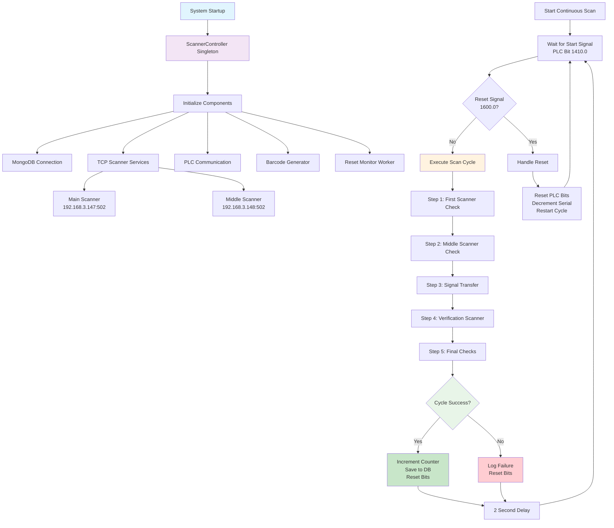
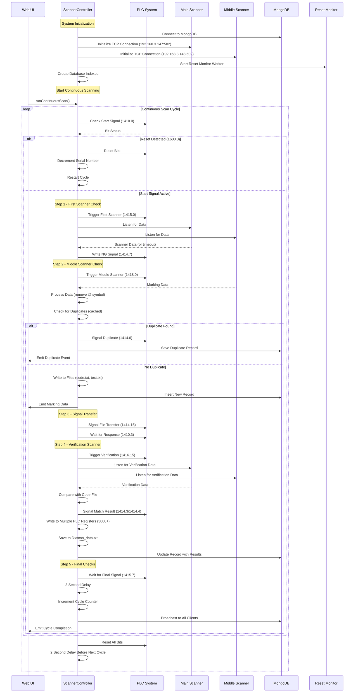
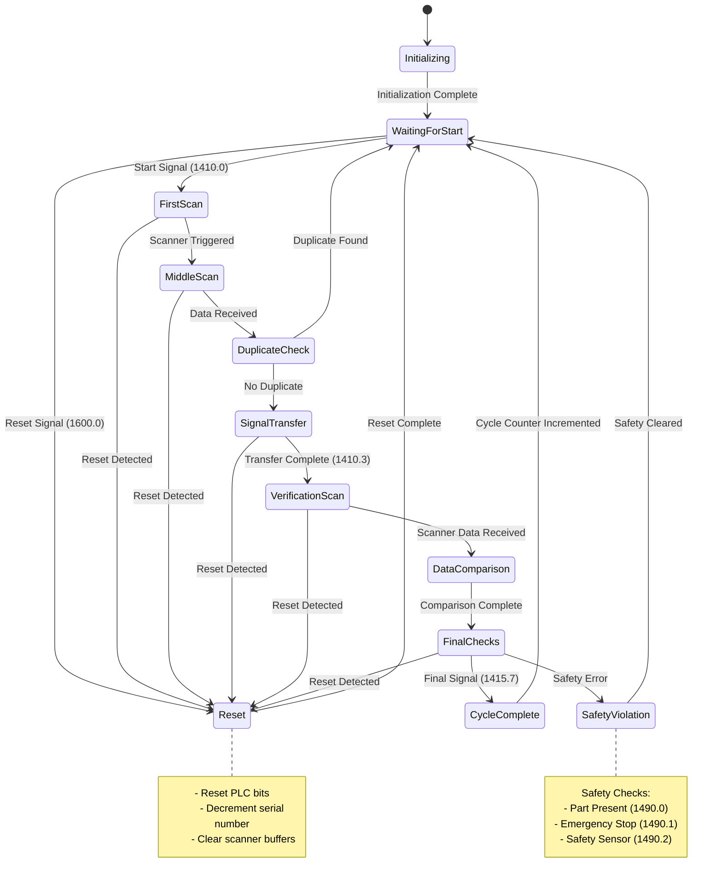
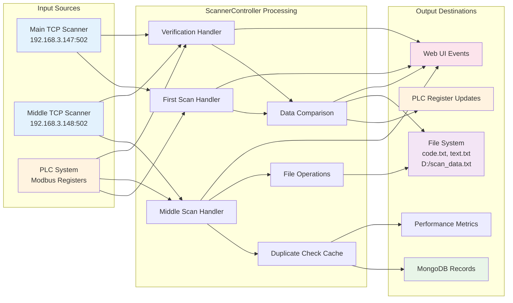
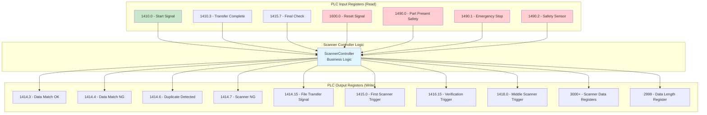
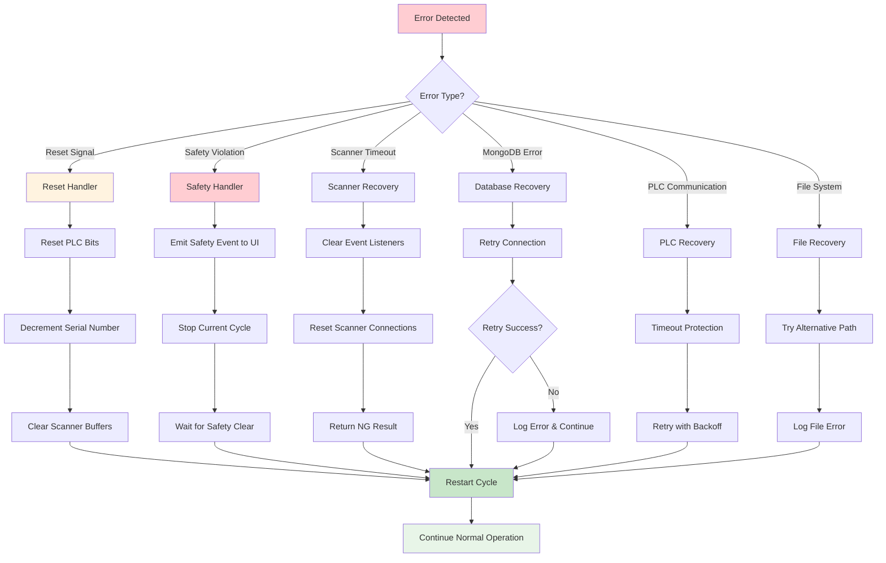
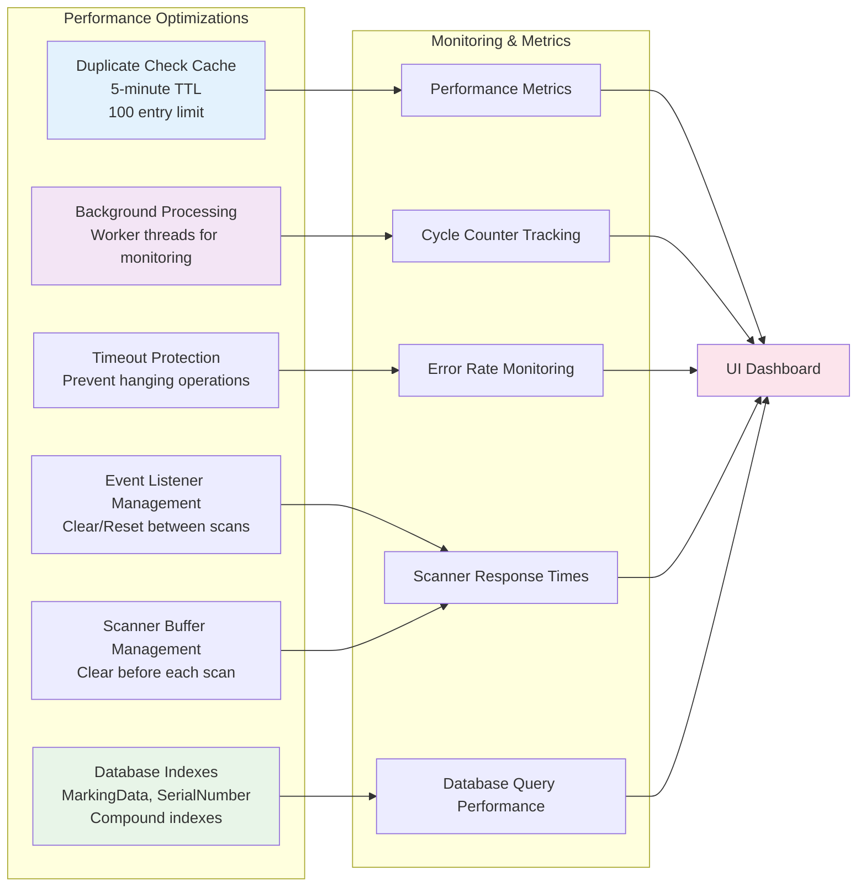

# Scanner Controller Business Logic Documentation

## File Overview
- **Language**: JavaScript (ES6 modules)
- **Runtime**: Node.js
- **Framework**: Industrial automation system with PLC integration
- **Patterns**: Singleton, Event-driven architecture, State machine, Worker threads
- **High-level purpose**: Controls a laser marking system with multiple TCP scanners, PLC communication, and MongoDB data persistence for manufacturing quality control

## Business Logic Orchestrator Graph



## Complete Business Flow Diagram



## State Machine Diagram



## Data Flow Architecture



## PLC Register Map & Communication Flow



## Error Handling & Recovery Flow



## Performance Optimization Architecture



## Key Business Rules & Logic

### 1. Scanner Priority & Fallback
- Both main and middle scanners listen simultaneously for data
- First scanner to respond wins
- Timeout handling returns "NG" to continue workflow

### 2. Duplicate Detection Logic
```javascript
// Cached duplicate checking with 5-minute TTL
// Performance optimization with MongoDB indexes
// Configurable to skip in debug mode
```

### 3. Data Processing Pipeline
```javascript
// Middle scan: Remove @ symbol prefix
// Verification: Compare against code.txt file
// PLC Writing: Split data into 16-bit registers (little-endian)
// File Writing: Multiple locations with fallback paths
```

### 4. Safety Interlocks
```javascript
// Continuous monitoring of safety bits:
// 1490.0 - Part not present
// 1490.1 - Emergency stop
// 1490.2 - Safety sensor not engaged
```

### 5. Reset Handling
```javascript
// Immediate cycle termination
// PLC bit cleanup
// Serial number decrement
// Scanner buffer clearing
// Automatic cycle restart
```

This documentation provides a comprehensive view of the scanner controller's business logic, showing how it orchestrates complex manufacturing workflows with multiple hardware components, safety systems, and data persistence requirements.